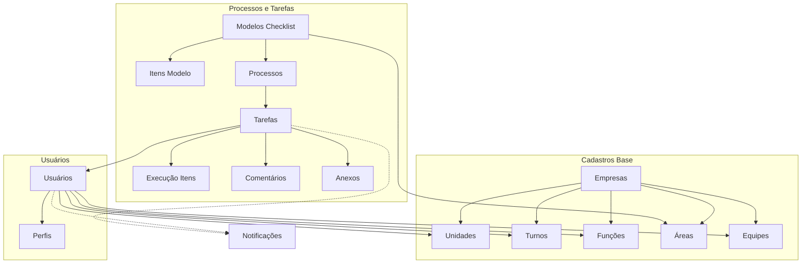

# Arquitetura do Sistema JCS-Processos

## Visão Geral
Sistema de gestão de processos operacionais com multitenancy por empresa.

## Estrutura de Entidades

## Módulos a Implementar

### 1. Unidades (unidades/)
CRUD de unidades de negócio vinculadas à empresa.

### 2. Turnos (turnos/)
Cadastro de turnos de trabalho (Manhã, Tarde, Noite).

### 3. Funções (funcoes/)
Cadastro de cargos/funções dos colaboradores.

### 4. Equipes (equipes/)
Cadastro de equipes de trabalho e vínculo com colaboradores.

### 5. Processos (processos/)
Workflow de processos operacionais baseados nos modelos.

### 6. Tarefas (tarefas/) - PRIORIDADE
Execução completa: criação, atribuição, execução, acompanhamento.

### 7. Dashboard (dashboard/)
Endpoints para visão consolidada do supervisor.

## Segurança
- JWT para autenticação
- Middleware de autorização por perfil
- Separação de dados por id_empresa em todas as queries

## Perfis e Permissões
| Perfil | Permissões |
|--------|------------|
| admin | Acesso total (*)|
| supervisor | Criar/atribuir tarefas, ver dashboard, relatórios |
| colaborador | Visualizar e executar tarefas atribuídas |
